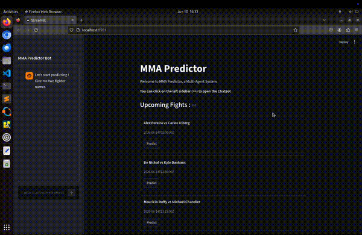

# MMA Predictor
Project developed as part of the **Current Trends in Artificial Intelligence** course (Vrije Universiteit Brussel).

Authors : Thomas Josephy, Arkadiusz Zaleski, Mikael Tom

Date : 10 June 2026


## Description of the Project

MMA Predictor is a multi-agent system that predicts the outcome of MMA fights and explains *why* it reached that prediction. Instead of relying on a single model, the system distributes the analysis across several specialized agents, each acting as an expert on one dimension of a fight: historical performance, recent news, market sentiment, and statistical modeling. Their outputs are aggregated by an orchestrator and handed to an LLM, which produces the final prediction while reasoning over every agent's findings rather than a single, potentially biased, source.

The user can interact with the system in two ways: through a conversational chatbot, or by browsing the upcoming fight calendar and selecting a fight directly.

This project was built to critically examine a real problem: sports betting content on social media routinely claims prediction accuracies of 95% or more. By building a genuine prediction pipeline grounded in data, agent coordination, and explainability, this project evaluates whether such claims are realistic, and demonstrates what an honest, transparent prediction system actually looks like.

## Project Video Demonstration



A short video demonstration is available showing the system in action : [Watch it here](https://youtu.be/)

## Why This Project Is Technically Interesting

**Multi-agent design.** Each agent specializes in one type of evidence rather than one model trying to do everything:

- **Historical Agent** : analyzes head-to-head records and win streaks.
- **News Agent** : retrieves recent context such as injuries or mental state through live web search.
- **Bet Agent** : reflects market sentiment by averaging odds from multiple bookmakers.
- **Predictor Agent** : produces a statistical prediction using XGBoost, chosen for its ability to capture complex, non-linear relationships between fight statistics.

An **Orchestrator** coordinates these agents, enforcing a structured workflow and validating each agent's output before it reaches the LLM. This separation of concerns keeps each agent simple and testable, while letting the final reasoning step (the LLM) synthesize multiple, independent perspectives instead of a single biased one.

**Explainable AI.** Rather than exposing only a final probability, the system integrates Diverse Counterfactual Explanations (DiCE) on top of the XGBoost model. DiCE generates several distinct "what would need to change for the outcome to flip" scenarios, which is more informative than a single counterfactual or a plain feature-importance score. The LLM is given three of these counterfactual scenarios so its final explanation is grounded in diverse, concrete evidence rather than a single narrow signal. As AI-assisted decision-making becomes more common, this kind of interpretability is treated as a first-class feature of the system rather than an afterthought.

**Engineering under real constraints.** The system was built entirely on free-tier APIs, which shaped several deliberate design choices:

- Fight schedules are cached and refreshed once every 7 days, and predictions are cached for 24 hours, since neither is expected to change meaningfully within those windows.
- User queries in the chatbot are first parsed with spaCy to extract fighter names before any LLM call is made; the LLM is only invoked as a fallback when spaCy fails to extract a name. This keeps token usage low without sacrificing reliability.
- Web scraping was attempted first but repeatedly got the system blocked; the project pivoted to API-based data sources instead, which proved far more stable and is reflected in the final architecture.

All the details and choices are explained in [`docs/report.pdf`](docs/report.pdf)

## Features

- Chatbot interface: ask for a prediction between any two fighters in natural language.
- Calendar interface: browse upcoming scheduled fights and request a prediction with one click.
- Explainable predictions grounded in counterfactual scenarios rather than a single opaque score.
- Automatic fallback from spaCy to LLM-based name extraction, minimizing unnecessary API calls.
- Caching layer for both predictions and fight schedules to reduce API usage and latency.

## Results
The system was evaluated on two real UFC fight nights. On the first, it correctly predicted 3 out of 4 winners, including the exact winning method for 2 of them. On the second, it correctly predicted 3 out of 8 winners, with 2 exact winning methods. Across both nights, prediction confidence correlated with accuracy, though high-confidence predictions were still occasionally wrong. These results are consistent with the project's original hypothesis: MMA outcomes, and especially the specific method of victory, are inherently difficult to predict, and any system claiming near-perfect accuracy should be treated with skepticism.

## Before Running the Code

### Prerequisites

Python 3.10+

### Install the Libraries

This project relies on the following libraries: `streamlit`, `spacy`, `openai`, `pandas`, `numpy`, `xgboost`, `scikit-learn`, `dice-ml`, `requests`.

Install them with:

```bash
pip install -r requirements.txt
```

Or, alternatively:

```bash
pip install streamlit spacy openai pandas numpy xgboost scikit-learn dice-ml requests
```

### Install the spaCy Model

The chatbot uses a spaCy model for name extraction. Install it with:

On Linux/Mac:
```bash
python3 -m spacy download en_core_web_sm
```

On Windows:
```bash
python -m spacy download en_core_web_sm
```

## API Keys Setup

This project relies on three external services. All of them offer a free tier that is sufficient to run and test the project. None of them require billing information tied to a bank account.

### GITHUB_TOKEN — LLM inference (GitHub Models, gpt-4o-mini)

The LLM calls are routed through GitHub Models, which gives free access to `gpt-4o-mini` with a generous daily quota for GitHub accounts.

1. Go to [https://github.com/settings/tokens](https://github.com/settings/tokens) and create a new personal access token (a fine-grained token with no additional scopes is enough).
2. Make sure your GitHub account has access to GitHub Models. If prompted, request access at [https://github.com/marketplace/models](https://github.com/marketplace/models) and select `gpt-4o-mini`.
3. Copy the generated token; this is the value to use for `GITHUB_TOKEN`.

### TAVILY_API_KEY — News Agent (web search)

The News Agent uses Tavily to retrieve recent, real-time context about fighters (injuries, recent statements, etc.).

1. Go to [https://www.tavily.com](https://www.tavily.com) and create a free account.
2. Once logged in, your API key is available directly on your dashboard.
3. Copy it; this is the value to use for `TAVILY_API_KEY`.

### BET_TOKEN — Bet Agent and fight schedule (The Odds API)

The Bet Agent and the fight calendar both rely on The Odds API to retrieve bookmaker odds and upcoming fight schedules.

1. Go to [https://the-odds-api.com](https://the-odds-api.com) and sign up for a free API key.
2. The key is sent to your email and is also visible on your account page after signing up.
3. Copy it; this is the value to use for `BET_TOKEN`.

### Setting the Environment Variables

Once you have the three keys, export them in the same terminal session you will use to run the application.

On Linux/Mac:
```bash
export GITHUB_TOKEN=<YOUR TOKEN>
export TAVILY_API_KEY=<YOUR TOKEN>
export BET_TOKEN=<YOUR TOKEN>
```

On Windows:
```bash
set GITHUB_TOKEN=<YOUR TOKEN>
set TAVILY_API_KEY=<YOUR TOKEN>
set BET_TOKEN=<YOUR TOKEN>
```

## How to Run
The entry point is `main.py`, located inside the `src/` folder.

From the root of the project, first move into `src/`, then launch the app:
```bash
cd src
streamlit run main.py
```

If this does not work, depending on your system, try:

```bash
cd src
python3 -m streamlit run main.py
```

Once launched, open your browser at [http://localhost:8501](http://localhost:8501)

Note: the first time you run the app, Streamlit may ask for an email to subscribe to its newsletter. This step is optional; press Enter to skip it.

## Troubleshooting

### The API key is not being picked up

Make sure the environment variables are exported in the exact same terminal session where you run `streamlit run main.py` (or `python3 -m streamlit run main.py`). Environment variables set in a different terminal or session will not be visible to the application.

### Port already in use

Run the application on a different port:

```bash
streamlit run main.py --server.port 8502
```

Or:

```bash
python3 -m streamlit run main.py --server.port 8502
```

You can replace `8502` with any port of your choice.

## Datasets

Credit goes to the following public datasets, which were used to build and train the prediction pipeline:

- [large_dataset.csv](Data/large_dataset.csv): [UFC Complete Dataset (all events 1996-2024)](https://www.kaggle.com/datasets/maksbasher/ufc-complete-dataset-all-events-1996-2024)
- [fighter_stats.csv](Data/fighter_stats.csv): [UFC Complete Dataset (all events 1996-2024)](https://www.kaggle.com/datasets/maksbasher/ufc-complete-dataset-all-events-1996-2024)
- [fighter_recent.csv](Data/fighter_recent.csv): [UFC Datasets 1994-2025](https://www.kaggle.com/datasets/neelagiriaditya/ufc-datasets-1994-2025?select=fighter_details.csv)
- [historical_data.csv](Data/historical_data.csv): [UFC Fights and Fighter Stats Dataset](https://www.kaggle.com/datasets/rajaisrarkiani/ufc-fights-and-fighter-stats-dataset?select=Fights+Data.csv)
